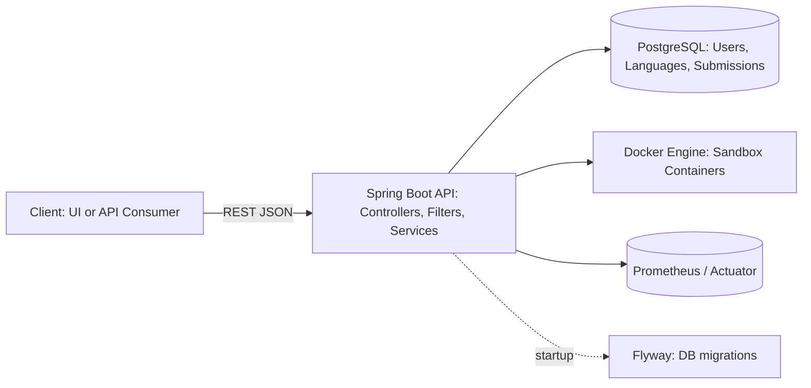
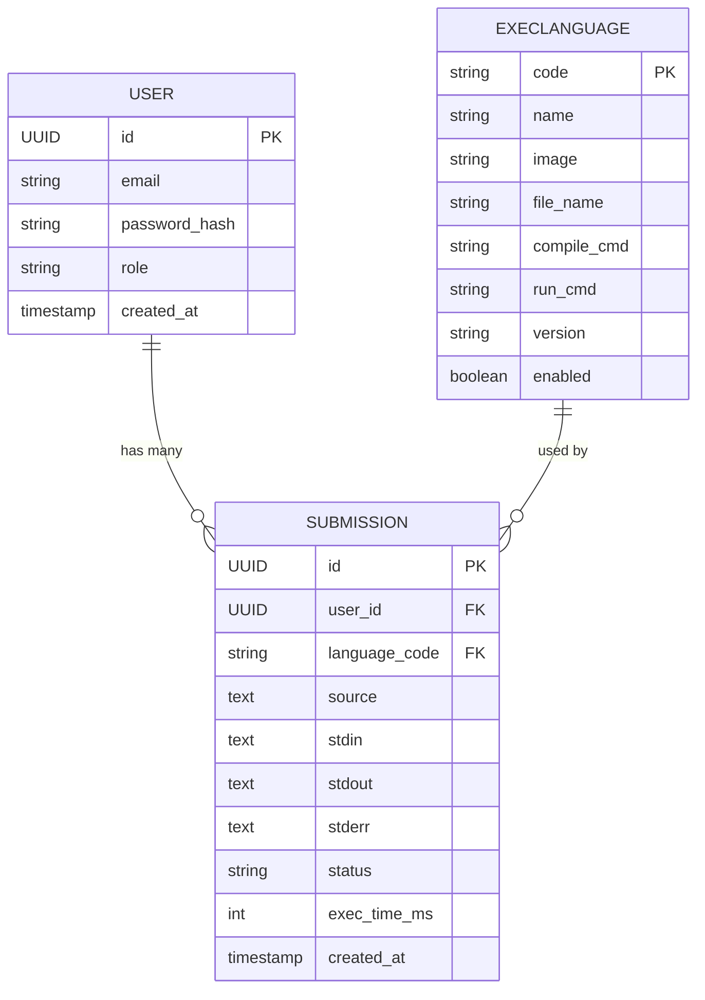

# CodeExecutorProject

*Run code snippets securely (Python, Java, C++ …) through a simple web API backed by Docker sandboxes.*

> Self-hosted Spring Boot service that compiles/runs user code in **isolated** containers, with JWT auth, rate limiting, metrics, and an admin API for language management.

---

## Project Overview (What & Why)

* **What it does:** A REST API where clients submit code (and optional input) and receive `stdout`, `stderr`, and status.
* **Problem it solves:** Avoids the pain of installing/maintaining multiple compilers/runtimes locally; runs untrusted code **safely** in resource-limited containers.
* **Key benefits:**

  * 🔒 Secure sandboxing (no network, limited CPU/RAM, read-only FS)
  * 🧰 Multi-language support via pluggable Docker images
  * 🧾 Submission history stored in PostgreSQL
  * 🛡️ JWT auth + per-user/IP rate limits
  * 📈 Prometheus/Actuator metrics
* **Who it’s for:** Learning platforms, interview systems, coding challenge sites, internal tools needing “run code” securely.

---

## Key Features

* **Multi-language execution** – Send source, get output. Java/C++ compile, Python runs directly.
* **Strong isolation** – Containers run with `--network none`, `--cpus`, memory, PID and tmpfs limits.
* **JWT Authentication** – `/api/auth/register`, `/api/auth/login`, `/api/auth/me`.
* **Submission logging** – Every run saved (source, stdin, stdout, stderr, status, time).
* **Rate limiting** – Per user/IP requests-per-minute; returns HTTP `429` when exceeded.
* **Admin language management** – Enable/disable languages; update image/tag and commands.
* **Observability** – Actuator health + Prometheus metrics for executions and timing.

---

## 🚀 Quick Start

### What You’ll Need

* **Java 17 + Maven** – Build the Spring Boot API.
* **Docker & Docker Compose** – Build language images and run the stack.
* **Host Docker Engine** – API mounts `/var/run/docker.sock` to launch sandboxes.

### Installation (Step-by-Step)

1. **Clone**

   ```bash
   git clone <your-repo-url>.git
   cd CodeExecutorProject
   ```

2. **Build language images** (Python, Java, C++ …)

   ```bash
   cd coderank-executor/languages
   ./build-all.sh
   ```

   *Builds images like `coderank/lang-python:3.11`, `coderank/lang-java:17`, etc.*

3. **Review environment**

   * Open `coderank-executor/docker-compose.yml`
   * Set `CODERANK_JWT_SECRET` to a strong random value.
   * Optional: change DB credentials/ports.

4. **Start services**

   ```bash
   cd ..
   docker-compose up -d
   ```

   *Starts PostgreSQL and the API on `http://localhost:8080`.*

5. **Sanity check**

   ```bash
   curl http://localhost:8080/actuator/health
   # {"status":"UP"}
   ```

---

## How to Use (Examples)

### 1) Register → get JWT

```bash
curl -X POST http://localhost:8080/api/auth/register \
  -H "Content-Type: application/json" \
  -d '{"email":"alice@example.com","password":"Secret123"}'
```

Response:

```json
{ "token":"<JWT>", "tokenType":"Bearer", "expiresInSeconds":1800 }
```

### 2) Login (if existing user)

```bash
curl -X POST http://localhost:8080/api/auth/login \
  -H "Content-Type: application/json" \
  -d '{"email":"alice@example.com","password":"Secret123"}'
```

### 3) Run Python

```bash
curl -X POST http://localhost:8080/api/execute \
  -H "Authorization: Bearer <JWT>" \
  -H "Content-Type: application/json" \
  -d '{
        "language":"python",
        "source":"print(\\"Hello, world!\\")",
        "stdin":""
      }'
```

Example response:

```json
{
  "stdout":"Hello, world!\n",
  "stderr":"",
  "status":"SUCCESS",
  "execTimeMs": 12
}
```

### 4) Run Java

```bash
curl -X POST http://localhost:8080/api/execute \
  -H "Authorization: Bearer <JWT>" \
  -H "Content-Type: application/json" \
  -d '{
        "language":"java",
        "source":"public class Main { public static void main(String[] args){ System.out.println(2+2); } }"
      }'
```

**Status codes** you may see: `SUCCESS`, `COMPILE_ERROR`, `RUNTIME_ERROR`, `TIMEOUT`, `INTERNAL_ERROR`.

---

## 🔧 Technical Details

### High-Level Architecture (HLD)



**Flow summary**

1. Client calls `/api/execute` with JWT.
2. Security filters: request ID, rate limit, JWT validate.
3. Service loads language config → submits task to orchestrator.
4. Orchestrator enforces global/per-user concurrency → calls Docker runner.
5. Docker runner builds secure `docker run` (no network, CPU/RAM/PID limits, read-only FS, tmpfs `/sandbox`) and executes compile/run commands.
6. Capture `stdout/stderr/exit`, map to status, persist `Submission`, return result.

### Entity-Relationship Diagram (ERD)



### Technologies Used

* **Spring Boot 3 (Java 17):** REST, Security (JWT), Data JPA, Actuator
* **PostgreSQL + Flyway:** persistence & migrations
* **Docker:** isolated code execution per request
* **Micrometer + Prometheus:** metrics
* **Maven:** build tooling

### Project Structure (typical)

```
coderank-executor/
├─ src/main/java/com/coderank/...
│  ├─ auth/           # AuthController, JwtService, UserDetails
│  ├─ execute/        # ExecuteController, ExecuteService, Orchestrator, DockerRunner
│  ├─ language/       # LanguageController, AdminLanguageController, ExecLanguage entity
│  ├─ submission/     # Submission entity/repo, AdminSubmissionController
│  ├─ config/         # SecurityConfig, filters (JWT, RateLimit, RequestId), metrics
│  └─ ...
├─ src/main/resources/
│  ├─ application.yml
│  └─ db/migration/   # Flyway migrations (schema + seed languages)
├─ languages/
│  ├─ build-all.sh    # builds coderank/lang-* images
│  └─ <language-dockerfiles>/
├─ docker-compose.yml
└─ Dockerfile
```

---

## Advanced Usage

### Configuration (environment)

```yaml
# application.yml (examples)
app:
  exec:
    timeoutSeconds: 5            # per-program time limit
    overallTimeoutSeconds: 12    # hard stop for container
    memory: 256m                 # Docker memory limit
    cpus: 0.5                    # Docker CPU quota
    pidsLimit: 128               # max processes
    tmpfsSizeMb: 64              # writable /sandbox size
  ratelimit:
    execute:
      perMinute: 30              # requests per minute per user/IP
spring:
  datasource:
    url: jdbc:postgresql://db:5432/coderank
    username: coderank
    password: coderank
jwt:
  secret: ${CODERANK_JWT_SECRET}
```

### Adding a new language

1. Create a Docker image with the compiler/interpreter.
2. Insert/update `ExecLanguage` (via admin API) with:

   * `code`, `name`, `image`, `fileName`, `compileCmd` (if needed), `runCmd`, `version`, `enabled`.

### Enabling CORS (future frontend)

Add a WebMvc config or `@CrossOrigin` on controllers to allow your frontend origin.

---

## 🤝 Contributing

We welcome contributions!

**New contributors**

1. Open an issue for bugs/ideas.
2. Improve docs where unclear.
3. Try “good first issue” labels (if present).

**Developers**

1. Fork & clone.
2. Create a branch: `git checkout -b feature/new-runtime`
3. Implement + add tests.
4. Run locally (`docker-compose up -d`).
5. Open a PR describing changes.

---

## Support, FAQ & Troubleshooting

**Where to get help:** GitHub Issues in this repo.

**FAQ**

* *Why did my code time out?*
  Execution exceeded `app.exec.timeoutSeconds` or overall container limit. Increase for trusted scenarios.
* *I see HTTP 429.*
  Rate limit or in-flight concurrency exceeded. Space requests out or adjust limits.
* *Docker permission errors?*
  Ensure your user can talk to Docker (`docker` group on Linux).

**Troubleshooting checklist**

* `docker ps` shows API and DB up?
* `curl /actuator/health` → `{"status":"UP"}`?
* Language images built (`docker images | grep coderank/lang-`)?
* JWT secret set and consistent across instances?

---

## 📋 Project Details

* **Status:** Active development
* **Version:** 0.1.0
* **License:** MIT (adjust if different)
* **Maintainer:** Ashraf Khan

**Roadmap**

* ✅ Multi-language sandbox, JWT auth, rate limit, metrics
* 🚧 More languages, async job pattern, better admin UX
* 📋 Frontend (with CORS), Kubernetes manifests, richer analytics

---

## ✅ Step-by-Step Testing Procedure

Use this as a full validation script after a clean start.

1. **Clean & start**

```bash
cd coderank-executor
docker-compose down -v
docker-compose up -d
sleep 5
curl http://localhost:8080/actuator/health
```

Expected: `{"status":"UP"}`

2. **Register & auth**

```bash
TOKEN=$(curl -s -X POST http://localhost:8080/api/auth/register \
  -H "Content-Type: application/json" \
  -d '{"email":"qa@example.com","password":"Secret123"}' | jq -r .token)
echo $TOKEN
```

Expected: a non-empty JWT printed.

3. **List available languages (public)**

```bash
curl -s http://localhost:8080/api/languages | jq
```

Expected: array with `python`, `java`, `cpp` (depending on seed).

4. **Happy path: Python**

```bash
curl -s -X POST http://localhost:8080/api/execute \
  -H "Authorization: Bearer $TOKEN" \
  -H "Content-Type: application/json" \
  -d '{"language":"python","source":"print(1+1)"}' | jq
```

Expected: `stdout: "2\n"`, `status: "SUCCESS"`.

5. **Compile error: Java**

```bash
curl -s -X POST http://localhost:8080/api/execute \
  -H "Authorization: Bearer $TOKEN" \
  -H "Content-Type: application/json" \
  -d '{"language":"java","source":"public class Main { public static void main(String[] args) { SYstem.out.println(42); } }"}' | jq
```

Expected: `status: "COMPILE_ERROR"`, error details in `stderr`.

6. **Runtime error: Python**

```bash
curl -s -X POST http://localhost:8080/api/execute \
  -H "Authorization: Bearer $TOKEN" \
  -H "Content-Type: application/json" \
  -d '{"language":"python","source":"print(1/0)"}' | jq
```

Expected: `status: "RUNTIME_ERROR"`, ZeroDivision traceback in `stderr`.

7. **Timeout: Python (infinite loop)**

```bash
curl -s -X POST http://localhost:8080/api/execute \
  -H "Authorization: Bearer $TOKEN" \
  -H "Content-Type: application/json" \
  -d '{"language":"python","source":"while True: pass"}' | jq
```

Expected: `status: "TIMEOUT"`.

8. **Rate limit check (optional)**
   Run 35 quick calls in under a minute; some should return `429 Too Many Requests`. If not, adjust `app.ratelimit.execute.perMinute`.

9. **Admin sanity (if you have an admin token)**

* List admin languages, update a language’s `enabled` flag, then call `/api/languages` to verify the change is reflected.

10. **DB verify (optional)**
    Connect to the DB and confirm `submissions` rows are created with expected statuses.

---
