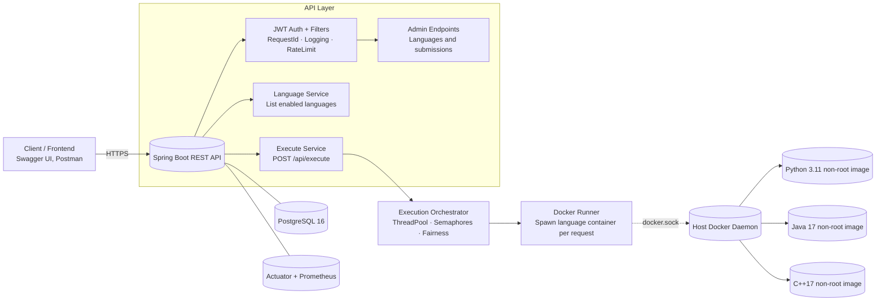
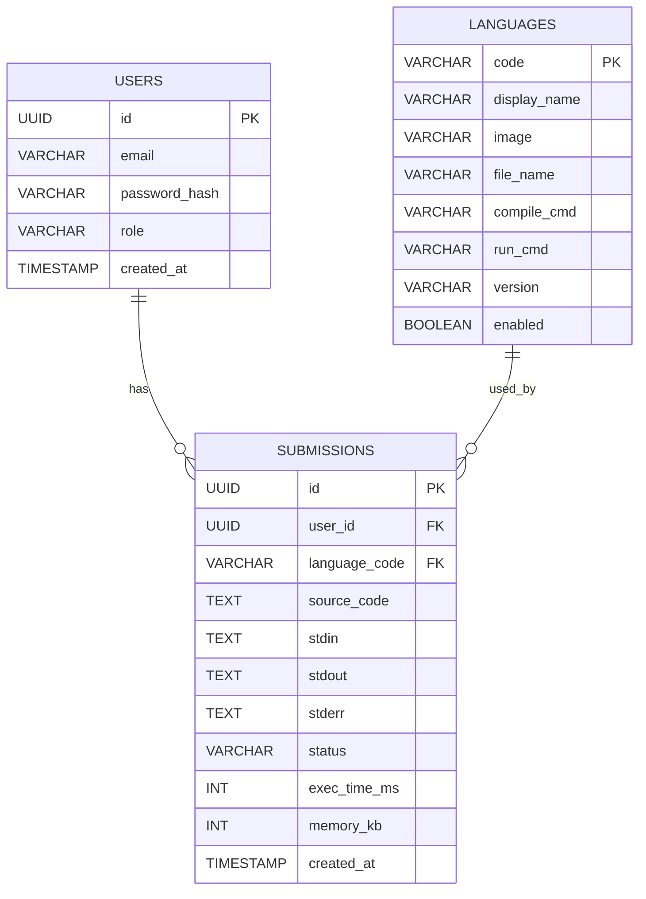

# CodeRank Executor

*Secure, Docker-based backend service that compiles and runs user code (Python, Java, C/C++) with strict isolation, JWT auth, rate-limits, and audit logs.*


[](#)
[-blue.svg)](#-api-quick-peek)
[](#-project-details)
[](#-project-details)

---

## What it does & why it exists

* **What it does (plain English):** Accepts code via a REST API, runs it inside a locked-down Docker container for the chosen language, and returns `stdout`, `stderr`, and a status like `SUCCESS` or `TIMEOUT`.
* **Problem it solves:** Running untrusted code is risky and complex. This gives you a safe, repeatable way to execute code at scale without giving users access to your servers.
* **Key benefits:**

  * **Safety:** Every run happens in a minimal, non-root container with limits.
  * **Simplicity:** A single `/api/execute` endpoint and a `/api/languages` catalog.
  * **Observability:** Prometheus metrics and health checks built in.
  * **Control:** JWT auth, per-user/IP rate-limits, and admin endpoints.
* **Who it’s for:** Ed-tech platforms, coding challenge sites, internal tools, or any product that must run user code securely.

---

## ✨ Key Features

* **Secure execution sandbox** — Runs code in short-lived Docker containers (non-root user, minimal images) to isolate processes.
* **Multi-language support** — Ships with Python 3.11, Java 17, and C++17; easily add more by defining a Dockerfile + commands.
* **Straightforward API** — `POST /api/execute` with `{ language, source, stdin? }` returns output and timing.
* **JWT authentication** — Register/login to get a token; pass it as `Authorization: Bearer <token>`.
* **Rate-limiting** — Per user/IP limits for `POST /api/execute` to prevent abuse and protect capacity.
* **Admin controls** — Toggle languages and inspect recent submissions with role-based access (`ROLE_ADMIN`).
* **Observability** — `/actuator/health` and `/actuator/prometheus` (Micrometer + Prometheus).
* **OpenAPI docs** — Explore & try endpoints at Swagger UI.

---

## Video Demo:
https://github.com/user-attachments/assets/77460bb7-c15f-4c26-b3c2-16b17284e483

https://github.com/user-attachments/assets/699c61d6-99dd-45e1-a85d-429ae43f324c


## 🚀 Quick Start

### What You’ll Need

* **Docker & Docker Compose** (to run the DB, app, and spawn sandbox containers)
* **\~4 GB RAM free** (container builds + app runtime)
* **Port 8080 and 5432 available** (app & DB defaults)

> Why Docker? The executor launches **language containers** per request. It binds to your host’s Docker daemon via `/var/run/docker.sock`.

### One-command bring-up (recommended)

```bash
# 0) (Optional) Build language images locally (faster first run)
./languages/build-all.sh

# 1) Start everything (Postgres + App)
docker compose up --build
```

What this does:

* Builds the app jar (Maven) and language images (if you ran step 0).
* Starts PostgreSQL with DB `coderank` and user/pass `coderank/coderank`.
* Starts the Spring Boot app with the `docker` profile and a JWT secret.

> After it’s healthy, visit:
> **Swagger UI:** [http://localhost:8080/swagger-ui/index.html](http://localhost:8080/swagger-ui/index.html)
> **Health:** [http://localhost:8080/api/health](http://localhost:8080/api/health)

### Local dev (without Compose)

```bash
# 1) Run Postgres (Docker)
docker run --name cr-db -e POSTGRES_DB=coderank \
  -e POSTGRES_USER=coderank -e POSTGRES_PASSWORD=coderank \
  -p 5432:5432 -d postgres:16

# 2) Build language images (once)
./languages/build-all.sh

# 3) Run the Spring app (host must have Docker)
export APP_SECURITY_JWT_SECRET="$(openssl rand -base64 48)"
export APP_SECURITY_JWT_ISSUER="coderank-executor"
export APP_SECURITY_JWT_EXPIRYMINUTES=60
mvn spring-boot:run
```

What this does:

* Boots Postgres for dev, prepares language containers, and starts the API with a strong JWT secret.

---

## 🧪 How to Use (Copy-paste examples)

### 1) Register → Login → Get Token

```bash
# Register
curl -s -X POST http://localhost:8080/api/auth/register \
  -H 'Content-Type: application/json' \
  -d '{"email":"me@example.com","password":"Str0ngP@ss!"}'
# → {"token":"<jwt>","expiresIn":3600}

# Login
curl -s -X POST http://localhost:8080/api/auth/login \
  -H 'Content-Type: application/json' \
  -d '{"email":"me@example.com","password":"Str0ngP@ss!"}'
# → {"token":"<jwt>","expiresIn":3600}
```

Save the `token` value (JWT). Use it in `Authorization`:

```
Authorization: Bearer <jwt>
```

### 2) List enabled languages

```bash
curl -s http://localhost:8080/api/languages
# → [{"code":"python","name":"Python 3.11","version":"3.11"}, ...]
```

### 3) Run “Hello, World!” in Python

```bash
curl -s -X POST http://localhost:8080/api/execute \
  -H 'Content-Type: application/json' \
  -H "Authorization: Bearer <jwt>" \
  -d '{"language":"python","source":"print(\"Hello, CodeRank!\")"}'
```

**Expected result (business meaning):** You’ll get `stdout: "Hello, CodeRank!\n"`, `stderr: ""`, `status: "SUCCESS"`, and an `execTimeMs` (used in analytics or leaderboards).

### 4) Run Java & C++ (copies you can tweak)

```bash
# Java
curl -s -X POST http://localhost:8080/api/execute \
  -H 'Content-Type: application/json' \
  -H "Authorization: Bearer <jwt>" \
  -d '{
    "language":"java",
    "source":"public class Main{public static void main(String[]a){System.out.println(\"Hi\");}}"
  }'

curl -X POST http://localhost:8080/api/execute \
  -H "Authorization: Bearer $TOKEN" \
  -H "Content-Type: application/json" \
  -d '{
    "language": "java",
    "source": "public class Main { public static void main(String[] args) { int x = 5/0; } }"
  }'

curl -X POST http://localhost:8080/api/execute \
  -H "Authorization: Bearer $TOKEN" \
  -H "Content-Type: application/json" \
  -d '{
    "language": "java",
    "source": "import java.util.*; public class Main { public static void main(String[] args) { Scanner sc = new Scanner(System.in); int a = sc.nextInt(); int b = sc.nextInt(); System.out.println(a+b); } }",
    "stdin": "10 32"
  }'

# C++
curl -s -X POST http://localhost:8080/api/execute \
  -H 'Content-Type: application/json' \
  -H "Authorization: Bearer <jwt>" \
  -d '{
    "language":"cpp",
    "source":"#include <iostream>\nint main(){std::cout<<\"Hi\";}"
  }'

#RateLimiter Test
for i in {1..40}; do
  echo "Request $i"
  curl -s -o /dev/null -w "%{http_code}\n" \
    -X POST http://localhost:8080/api/execute \
    -H "Authorization: Bearer $TOKEN" \
    -H "Content-Type: application/json" \
    -d '{
      "language":"java",
      "source":"public class Main { public static void main(String[] args){ System.out.println(42); } }"
    }'
done
```

> **Statuses you may see:** `SUCCESS`, `COMPILE_ERROR`, `RUNTIME_ERROR`, `TIMEOUT`, `INTERNAL_ERROR`.

---

## 🔧 Technical Details

### Architecture Overview
---

You're running into a Mermaid parsing quirk on GitHub: **parentheses inside node labels** can be misread as shape syntax, and raw `&` also needs escaping. I’ve removed the parentheses, replaced `&` with `&amp;`, and kept line breaks with `<br>` (which GitHub’s Mermaid accepts).

### ✅ Drop-in fixed HLD (GitHub-compatible)



### ✅ ER Diagram (Mermaid-compatible)

> Note: Keep attribute comments out of the braces; GitHub’s Mermaid ER parser is strict.



* **API**: `/api/auth/*`, `/api/languages`, `/api/execute`, `/api/admin/*`
* **Security chain**: `RequestId` → `JWT` → `RateLimit` → `RequestLogging`
* **Concurrency**: Bounded thread-pool + semaphores to cap total and per-user in-flight runs
* **Runtime**: Each execution writes source to container, optional compile, then runs with a hard timeout

> This matches `V1__init.sql` and the `@Entity` classes (`User`, `ExecLanguage`, `Submission`).

### Technologies Used

* **Spring Boot 3 (Java 17)** — REST API, security filters, validation
* **PostgreSQL + Flyway** — schema migration and persistence
* **Docker** — per-execution language sandboxes
* **Micrometer + Prometheus + Actuator** — metrics and health
* **springdoc-openapi** — Swagger UI for interactive docs
* **BCrypt + JWT (JJWT)** — password hashing and token issuance

### Project Structure

```
coderank-executor/
├── docker-compose.yml            # Postgres + App (binds docker.sock)
├── Dockerfile                    # Build & runtime image for the API
├── languages/                    # Dockerfiles for runtimes
│   ├── build-all.sh
│   ├── python/Dockerfile
│   ├── java/Dockerfile
│   └── cpp/Dockerfile
├── src/main/java/com/coderank/executor/
│   ├── auth/                     # Register/Login + DTOs
│   ├── admin/                    # Admin endpoints (languages, submissions)
│   ├── execute/                  # Orchestrator, Docker runner, API DTOs
│   ├── language/                 # Language entity + service
│   ├── security/                 # JWT, SecurityConfig
│   ├── user/                     # User entity + repository
│   └── web/                      # Health, rate-limit, logging filters
├── src/main/resources/
│   ├── application.yml           # Base config (profiles, flyway)
│   ├── application-dev.yml       # Local dev DB + rate-limit
│   ├── application-docker.yml    # Compose profile (DB host= db)
│   └── db/migration/V1__init.sql # ERD-compatible schema
└── pom.xml
```

---

## ⚙️ Configuration & Advanced Usage

### Configuration keys (with sensible defaults)

Put these in `application.yml` or set as environment variables (Spring maps `APP_SECURITY_JWT_SECRET` → `app.security.jwt.secret`):

```yaml
# Security & JWT
app:
  security:
    jwt:
      issuer: "coderank-executor"
      expiryMinutes: 60
      secret: ${APP_SECURITY_JWT_SECRET}   # base64-encoded key (>= 256 bits)
  ratelimit:
    execute:
      perMinute: 30

# Execution concurrency controls
app:
  exec:
    concurrent:
      maxConcurrent: 6         # total concurrent runs
      queueCapacity: 20        # queued submissions
      submitTimeoutMs: 150     # fail fast if queue is full
      permitTimeoutMs: 200     # acquire-run permit timeout
      perUserMaxInFlight: 2    # fairness per user/IP
```

> **Tip:** Generate a strong secret: `openssl rand -base64 48` and pass it as `APP_SECURITY_JWT_SECRET`.

### Admin endpoints (require `ROLE_ADMIN`)

* `GET /api/admin/submissions?limit=50` — newest submissions
* `PATCH /api/admin/languages/{code}` — enable/disable or change commands/image

Make your user an admin (dev only):

```sql
-- psql -h localhost -U coderank -d coderank
UPDATE users SET role = 'ADMIN' WHERE email = 'me@example.com';
```

### Metrics & Health

* `GET /actuator/health` — basic health
* `GET /actuator/prometheus` — scrapeable metrics (e.g., `coderank_execute_requests_total`)

---

## 🧭 End-to-end Test Plan (step-by-step)

1. **Build language images** (if not using Compose autobuild)

   ```bash
   ./languages/build-all.sh
   ```

   *Ensures Python/Java/C++ runtimes exist locally.*

2. **Start services**

   ```bash
   docker compose up --build
   ```

   *Brings up Postgres and the API. Wait until logs say `Started CoderankExecutorApplication`.*

3. **Open API docs**

   * [http://localhost:8080/swagger-ui/index.html](http://localhost:8080/swagger-ui/index.html)
     *Confirms routing and OpenAPI are live.*

4. **Register & Login**

   * Use Swagger UI or the curl commands above to get a JWT.
     *Confirms DB writes and JWT issuance.*

5. **List languages**

   ```bash
   curl -s http://localhost:8080/api/languages
   ```

   *Confirms seed data / Flyway migration.*

6. **Run sample programs**

   * Python “hello” (expected `SUCCESS` and `stdout` as shown).
   * Java and C++ variants (compile once, then run).
     *Confirms Docker socket access and container lifecycle.*

7. **Rate-limit check (optional)**

   * Rapidly fire > `perMinute` requests to `/api/execute`.
   * Expected: JSON error indicating rate limit exceeded.
     *Confirms protective throttling works.*

8. **Admin list submissions (optional)**

   * Promote your user to admin (SQL above).
   * `GET /api/admin/submissions?limit=10`
     *Confirms persistence and admin filter.*

9. **Metrics**

   * `curl -s http://localhost:8080/actuator/prometheus | head`
     *Confirms Micrometer export.*

10. **Troubleshooting common issues**

    * **DB auth error** (`FATAL: password authentication failed for user "coderank"`):
      Ensure Postgres is healthy and creds match your profile (`application-*.yml`) and environment.

      ```bash
      docker exec -it <db-container> psql -U postgres -c \
        "ALTER USER coderank WITH PASSWORD 'coderank';"
      ```
    * **Docker socket permission**: App container must mount `/var/run/docker.sock`. This is already configured in `docker-compose.yml`.
    * **JWT 401 errors**: Verify `Authorization: Bearer <jwt>` header and that your clock is correct (token expiry).
    * **Timeouts** on heavy code: The runner enforces a strict time limit; reduce workload or increase allowed time in language commands (advanced).

---

## 🔌 API Quick Peek

* `POST /api/auth/register` → `{ token, expiresIn }`
* `POST /api/auth/login` → `{ token, expiresIn }`
* `GET /api/auth/me` → `{ id, email, role }`
* `GET /api/languages` → `[ { code, name, version } ]`
* `POST /api/execute` → `{ stdout, stderr, status, execTimeMs }`
* `GET /api/admin/submissions` *(ADMIN)* → `[ { id, userId, languageCode, ... } ]`
* `PATCH /api/admin/languages/{code}` *(ADMIN)* → update language config

> See everything interactively in **Swagger UI**.

---

## 🤝 Contributing

We welcome contributions!


### For Developers

1. Fork the repository
2. Create your feature branch
   `git checkout -b feature/amazing-feature`
3. Make your changes (keep code formatted)
4. Add/adjust tests if applicable
5. Run the test plan above locally
6. Submit a pull request

*See `CONTRIBUTING.md` (recommended) for code style, commit message format, and review guidelines.*

---

## 🧩 Advanced Notes (power users)

* **Add a new language:**
  Create `languages/<name>/Dockerfile`, build and push an image, then seed a row in `languages` with:

  * `code`, `display_name`, `image`, `file_name`, `compile_cmd?`, `run_cmd`, `version`, `enabled`
* **Tune throughput:**
  Adjust `app.exec.concurrent.*` for pool size, queue length, and fairness.
* **Customize rate limits:**
  Set `app.ratelimit.execute.perMinute` to a value appropriate for your capacity.
* **Logging correlation:**
  Every response has an `X-Request-Id` header; include it in bug reports.

---

## 🧑‍💼 Support & Community

* **Docs:** Swagger UI + this README
* **Help:** Open an issue with steps to reproduce (include `X-Request-Id`)
* **FAQ (quick):**

  * *Can anonymous users execute?* Yes if allowed, but results still respect rate-limit by IP. (In this template, endpoints require auth by default except health/docs—update `SecurityConfig` if you want public runs.)
  * *Where are files stored?* Nothing persists in containers; outputs and metadata are stored in Postgres via `Submission`.
  * *Is code scanned?* The primary defense is sandboxing + time limits; add static checks if your use case requires.

---

## 📋 Project Details

* **Status:** Active Development
* **Version:** 0.0.1-SNAPSHOT
* **License:** MIT — see `LICENSE`
* **Maintainers:** CodeRank Team (add handles/emails here)

### Roadmap

* ✅ Python/Java/C++ sandboxes
* ✅ JWT auth, rate-limits, admin endpoints
* ✅ OpenAPI + Prometheus metrics
* 🚧 Language whitelisting per tenant/user
* 🚧 Persistent artifacts (optional) with signed URLs
* 📋 Pluggable runners (Firecracker/OCI) & GPU languages

---

## Accessibility, Formatting & Style

* Images & diagrams have alt text.
* Headings follow a logical hierarchy.
* Code blocks are copy-paste ready and annotated.
* Links use descriptive text.

---

## Appendix A — Sample `application-docker.yml` (for reference)

```yaml
spring:
  datasource:
    url: jdbc:postgresql://db:5432/coderank
    username: coderank
    password: coderank
  jpa:
    hibernate:
      ddl-auto: validate
    properties:
      hibernate.jdbc.time_zone: UTC

app:
  security:
    jwt:
      issuer: "coderank-executor"
      expiryMinutes: 60
      secret: ${APP_SECURITY_JWT_SECRET}
  ratelimit:
    execute:
      perMinute: 30

app:
  exec:
    concurrent:
      maxConcurrent: 6
      queueCapacity: 20
      submitTimeoutMs: 150
      permitTimeoutMs: 200
      perUserMaxInFlight: 2

management:
  endpoints:
    web:
      exposure:
        include: health,info,metrics,prometheus
      base-path: /actuator
```
